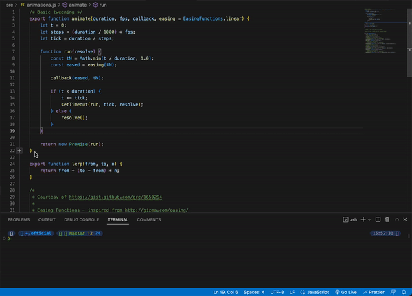
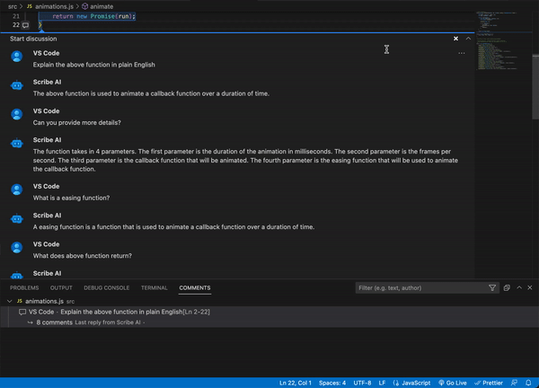
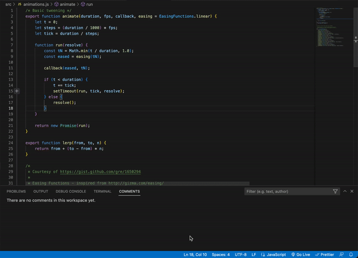
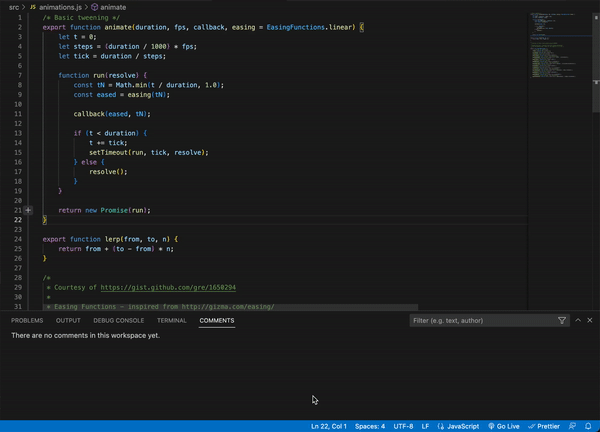
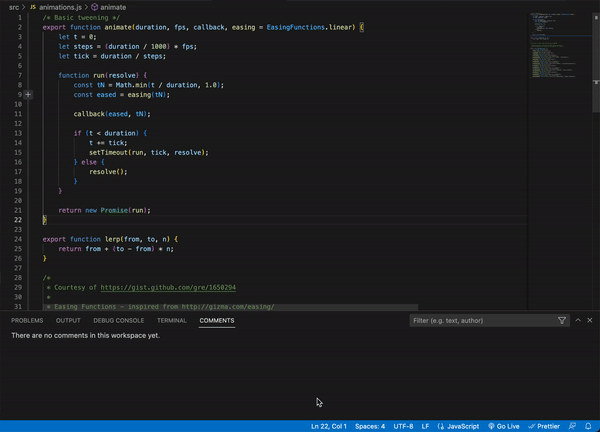
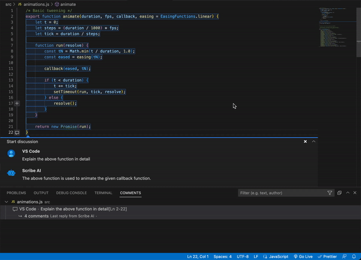
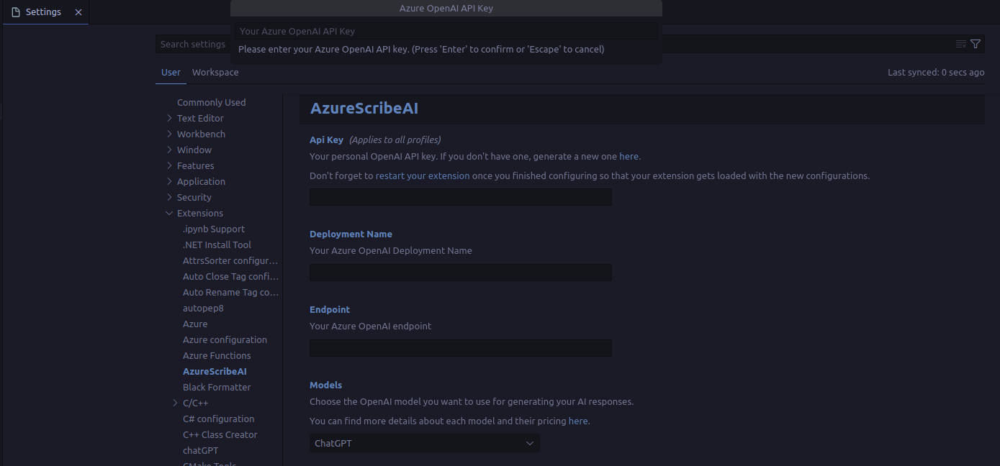

    

<h1 align="center">Azure Scribe AI</h1>

This project is a simple fork of <a href="https://github.com/ajikan/ScribeAI">ScribeAI</a> that uses Azure OpenAI instead of OpenAI.

Scribe AI is a ChatGPT-like extension for VS Code. Now you can have an AI chatbot like ChatGPT right in VS Code! Use it as your AI programming assistant which you can talk with to understand complex code, modify and improve your code, or generate comments for your code. The possibilities are endless. To start, highlight a piece of code and click on the plus icon on the left to open up a chat and start talking with Scribe AI just like in ChatGPT! All your conversations are saved in your workspace so you can look back on them as notes.

<h4 align="center">
  <a href="https://marketplace.visualstudio.com/items?itemName=JeremySemel.azurescribeai">🔗 VSCode Marketplace</a>
</h4>

&nbsp;

# 📢 v2.0 Release

-   Based on the original <a href="https://marketplace.visualstudio.com/items?itemName=AndrewZhang.scribeai">ScribeAI</a> v1.2.1
-   I have added the ability to use it with Azure OpenAI.

&nbsp;

# 🌟 Preview

  

&nbsp;

# ✨ Features

-   💬 **Ask AI:** Highlight a piece of code, click on the chat icon, and type in any questions you might have about the code such as `Explain the code`. Then hit `Ask AI` button! The AI will respond back to you with the response. You can continue to reply to the AI’s response and hold a conversation with the AI just like in ChatGPT! The conversation context is maintained between queries. The conversation will be saved in your workspace and you can close it and open it anytime. You can also edit your comments and delete them.

  

**_Editing:_**

  

&nbsp;

-   🧠 **AI Edit:** Highlight a piece of code and click on the chat icon, then enter the instruction on how you want the AI to modify the code such as `Refactor the code to include comments`, `Rewrite the code in Python`, and much more! The possibilities are endless. Now finally hit `AI Edit` button and you will see that your selected code has been modified. If you don’t like the result you can always Undo it by pressing `Mac:` <kbd>⌘ Command</kbd> + <kbd>Z</kbd>, `Windows:` <kbd>Ctrl</kbd> + <kbd>Z</kbd> or go to `Edit -> Undo`. Sometimes the formatting of the result is not correct or your originally highlighted section gets messed up, in such cases you can rehighlight the code and ask AI to `Reformat the code so that it’s correct` and press the `AI Edit` button.

**_Refactoring:_**

  

**_Rewriting in another lanugage:_**

  

**_Adding docstring:_**

  

**_Fixing mistakes:_**

  

&nbsp;

-   📝 **Note Taking:** You can also add notes inside your conversation by typing your note and pressing `Create Note`. Your notes won’t get sent over to AI.

  

&nbsp;

# 🚀 Getting Started

## 📦 Installation

-   To use this extension, you can install it from the VSCode marketplace.

### 📑 Download extension from VSCode Marketplace

-   Click on the Extensions icon(Ctrl+Shift+X)

-   Search for `AzureScribeAI`

-   The extension on VSCode marketplace looks like this, click the install button.

-   Once installation is complete, go to settings and search for `AzureScribeAI` to add your Azure OpenAI API key, endpoint and deployment name. When you install and use Azure ScribeAI for the first time, it will ask you for your Azure OpenAI API key, endpoint and deployment name.

## ⚙️ Settings

-   You can change your API key, endpoint and deployment name in User Settings via `Code` -> `Preferences` -> `Settings` and under `Extensions` you will find `AzureScribeAI` settings. Or you can just search `AzureScribeAI` in search box.

  

